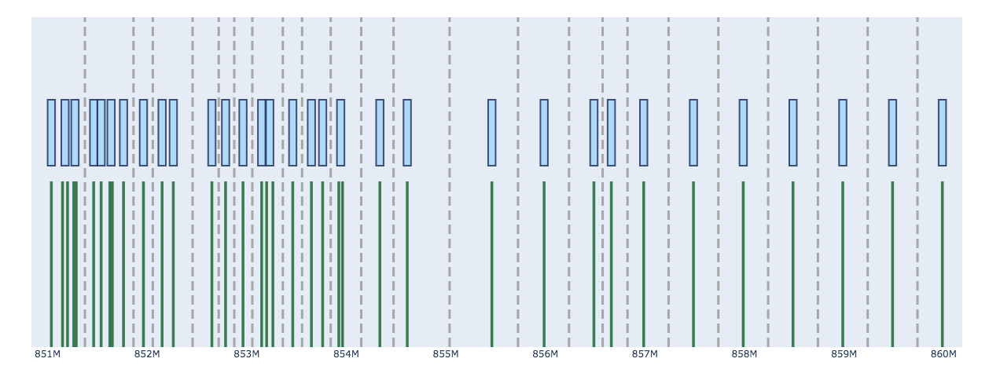

# BDA-Filters
Utility for determining optimal BDA filter configurations for US public safety radio channels.

<p align='center'>

</p>

# Rationale
[FCC Part 90](https://www.ecfr.gov/current/title-47/chapter-I/subchapter-D/part-90/subpart-I/section-90.219) Class A (channelized) signal boosters have a limited number of configurable filters with variable bandwidths. Ideally, filters would be configured 1:1 with signals they are intended to amplify. This approach often fails due to delay limitations and the number and position of desired channels. Narrow filters induce long delays which can result in time delay interference or an unusable system, so filter bandwidths must be increased to reduce delays to acceptable amounts. Widening filters can cause neighboring filters to overlap, which is not possible in most BDAs. Dense groups of desired channels and/or more desired channels than available filters necessitates filters passing multiple channels.

This utility solves this problem by determining optimal filter configuration given a channel list and filter limitations (i.e. the number of filters and the filter bandwidths). Filters are selected in order to maximize the number of filters in order to maximize control granularity for each band, ideally targeting 1:1 filter to channel placement.

# Usage
Pass a list of channels (.csv or .txt) as an argument. If a valid solution is found, filters are output to filters.txt.

```python3 bda_filters.py "path/to/channels.csv"```

Multiple channel lists can be passed at once.

```python3 bda_filters.py "path/to/channels.csv" "path/to/moreChannels.txt"```

Channel width, filter width, and number of filters can be adjusted in [settings.py](settings.py).

# Requirements
* Python 3.6+
* plotly


# Disclaimer
Use this tool at your own risk. None of this methodology has been reviewed or endorsed by the FCC. Ensure approval by all affected PLMRS licensees before deploying signal boosters.